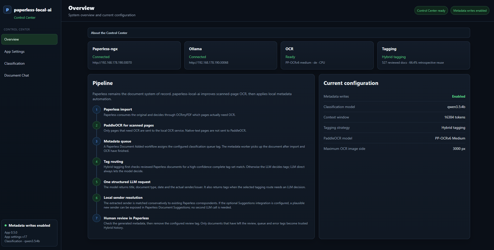

> [!NOTE]
> This project has been entirely vibe-coded. It works in my setup, but it has not been thoroughly reviewed or tested. Expect bugs and use it at your own discretion.

# paperless-local-ai

**Improved OCR with PaddleOCR and efficient local-LLM metadata automation for Paperless-ngx — designed for modest CPU-only hardware.**

`paperless-local-ai` uses **PaddleOCR instead of Tesseract** for scanned pages that need OCR and automatically writes Paperless metadata — **title, document type, date, tags and correspondent** — with a local Ollama model. It integrates into Paperless' existing OCRmyPDF import path, so Paperless remains the document system of record.

Normal metadata classification is handled in **one LLM request with structured JSON output per document** and the result is written back automatically. If no existing correspondent can be matched, an optional second, narrowly scoped correspondent request can place a new correspondent candidate into **Paperless Document Suggestions** instead of creating it automatically.

## Highlights

- **Improved scan OCR with PaddleOCR** — PP-OCRv6 Medium is the quality-focused default, with Small and Tiny profiles selectable when lower inference cost matters; bounded automatic retries recover from transient OCR worker/service failures.
- **Automatic metadata assignment in one LLM request** — title, document type, date, tags and an existing correspondent are classified together and written back to Paperless automatically.
- **Designed for CPU-only systems** — the OCR and LLM paths are deliberately structured to avoid repeated model work and simultaneous heavy inference.
- **Paperless-native correspondent Suggestions** — the common path stays at one LLM request; only an unresolved correspondent can trigger a second, focused request. Genuinely new correspondents are surfaced through Paperless Suggestions and are never auto-created.
- **Control Center** — configure connections, workflow tags, OCR settings, prompts, model parameters, Dry Run and configuration history from one UI.

## Why this architecture

`paperless-local-ai` is designed around three priorities: **OCR quality, practical local inference on modest CPU-only hardware, and reliable automation inside Paperless.**

**Better OCR before the LLM.** Metadata classification can only be as reliable as the text it receives. For the document set this project was built around, Tesseract output was often not clean enough for reliable classification with a small local model. Vision-language models can avoid a separate OCR step, but are much more demanding on older CPU-only hardware. `paperless-local-ai` therefore uses **PaddleOCR with PP-OCRv6**, defaulting to the quality-focused Medium profile. Small and Tiny can be selected when lower inference cost matters more than maximum recognition quality, while HPI/OpenVINO accelerates the selected profile on CPU.

**One LLM request per document.** Field-by-field classification repeats much of the same prompt processing for title, document type, date, tags and correspondent. `paperless-local-ai` returns all normal metadata together in **one LLM request with structured JSON output per document**. The reference setup uses the small `qwen3.5:4b` model, keeping local classification practical even when a single CPU inference already takes around a minute.

**Automatic, but constrained.** Normal classification results are written back to Paperless automatically, while document types, tags and existing correspondents are constrained to values that already exist in Paperless. If no existing correspondent can be resolved, the optional fallback can identify a new name, but new correspondents are exposed through **Paperless Document Suggestions** for human review instead of being created automatically.

**Resource-aware execution.** PaddleOCR/OpenVINO and Ollama inference are serialized through a shared resource lock so both heavy workloads do not consume the same CPU and RAM at the same time.

Additional runtime optimizations include skipping PaddleOCR for native-text pages, reusing the OCR process across consecutive pages, keeping inference artifacts cached and unloading heavy model processes again when they are no longer needed.

## Reference performance

**Intel Core i3-8100 · 4 cores / 4 threads · 16 GB RAM · no GPU · qwen3.5:4b Q4_K_M · PP-OCRv6 Medium / HPI / OpenVINO**

| Component | Measured time |
|---|---:|
| First scanned page after OCR idle | **23.6 s** |
| Additional page in the same warm OCR session | **17.6 s/page** |
| Metadata classification | **80.1 s/document** |
| Optional correspondent fallback | **+53.4 s** when needed |

OCR time scales per scanned page, while normal metadata classification runs once per document. The correspondent fallback is an additional LLM request only when the main classification cannot resolve an existing correspondent.

These measurements are a reference point for this specific CPU-only system, not a performance guarantee.

## RAM usage and tuning

The main memory consumers are **PaddleOCR during OCR** and the **Ollama model during metadata classification**. They are serialized, so their heavy memory peaks normally do not occur at the same time.

Measured on the reference setup:

| Workload | Configuration | Measured peak |
|---|---|---:|
| OCR | PP-OCRv6 Medium · 3000 px | **~4.4–4.7 GiB** |
| OCR | PP-OCRv6 Medium · 3200 px | **~4.9–5.1 GiB** |
| OCR | PP-OCRv6 Medium · 4000 px | **~6.5 GiB** |
| Metadata | qwen3.5:4b Q4_K_M · 4k context | **~3.6 GiB** |
| Metadata | qwen3.5:4b Q4_K_M · 8k context | **~3.8 GiB** |
| Metadata | qwen3.5:4b Q4_K_M · 16k context | **~4.2 GiB** |

The 16k metadata value comes from a real classification run with the production prompt/settings; the lower-context measurements use the same model with a short fixed test request. Actual memory use varies with model, document and runtime.

If RAM is limited:

- **OCR:** lower **Maximum OCR image dimension**. This is the main OCR memory control and changes only the temporary image sent to PaddleOCR; the original PDF is unchanged.
- **OCR:** use **PP-OCRv6 Small** or **Tiny** if lower inference cost matters more than maximum recognition quality. Exact RAM savings for those models have not been benchmarked yet.
- **LLM:** reduce the **Context window**. With qwen3.5:4b, 4k / 8k / 16k measured roughly 3.6 / 3.8 / 4.2 GiB.
- **LLM:** use a smaller Ollama model if more memory needs to be saved.

With about **5 GiB available for AI processing**, the tested 3000 px OCR setting and qwen3.5:4b at a 16k context are close to the upper end of that budget individually. Reducing the LLM context to 8k gives more headroom; lower the OCR image dimension if OCR still approaches the available memory.

See [Configuration](docs/configuration.md#ram-usage-and-tuning) for the detailed controls.

## How it fits into Paperless

During import, Paperless/OCRmyPDF decides whether a page needs OCR. Native-text pages stay on Paperless' normal text path. When OCR is required, the included OCRmyPDF plugin sends the rasterized page to the local `ocr-service`, where PaddleOCR runs PP-OCRv6 and returns OCRmyPDF's native `OcrElement` tree.

Tesseract is not used for OCR inference on pages handled by the plugin.

After the document has been added, a normal Paperless **Document Added** workflow assigns the `LLM` queue tag. The metadata worker then classifies the completed document and automatically writes the resulting title, document type, date, tags and resolved existing correspondent back to Paperless.

**Diagram colors:** blue = Paperless-ngx / OCRmyPDF · green = paperless-local-ai · purple = optional Correspondent fallback

  

Paperless remains the document system of record throughout:

- the uploaded **original is preserved**;
- OCRmyPDF creates the searchable archive/PDF-A representation;
- Paperless stores the extracted OCR text;
- `paperless-local-ai` writes metadata back to the same Paperless document.

OCR runs during Paperless import; no separate OCR queue tag is required.

## Metadata automation

The main classifier processes the document once and returns a structured result containing:

- title;
- document type;
- date;
- content tags;
- an existing correspondent.

This avoids sending the full document through the LLM again for each metadata field.

If the main request cannot match an existing correspondent and the optional fallback is enabled, a **separate correspondent-only request** runs with its own prompt and model settings. An exact existing match can still be applied automatically; a genuinely new correspondent is exposed through **Paperless Document Suggestions** for review instead of being auto-created. The configured model stays loaded across the main request and fallback when both are needed, then is explicitly unloaded.

### Correspondents

The primary classification is constrained to correspondents already present in Paperless.

The optional fallback can then:

- apply an exact existing correspondent automatically;
- expose a genuinely new correspondent through **Paperless Document Suggestions**;
- leave the correspondent empty when no reliable correspondent can be determined.

New correspondents are never auto-created.

## Control Center

The Control Center configures normal app behavior:

- Paperless and Ollama connections;
- LLM queue/error/review tags;
- OCR language, PaddleOCR model, temporary OCR image limit, automatic retry schedule and recovery status;
- metadata Dry run and advanced worker timing;
- Classification prompts, model settings and safe tests;
- optional Correspondent fallback.

Prompts and model settings can be previewed and tested against an existing Paperless document without modifying that document. Saved configurations are versioned and can be restored.

## Requirements

Paperless-ngx · Ollama · Docker Compose or TrueNAS SCALE · linux/amd64

Tested reference: **Paperless-ngx 3.0.5 · OCRmyPDF 17.4.2 · TrueNAS SCALE 25.10.6 · Ollama 0.32.11**. See [Compatibility](docs/compatibility.md) for the exact tested scope.

## Install

Choose one deployment guide:

- [Docker Compose](docs/installation.md)
- [TrueNAS SCALE](docs/truenas.md)

Then complete the required [Paperless integration](docs/paperless-setup.md) and review [Configuration](docs/configuration.md).

More: [Troubleshooting](docs/troubleshooting.md) · [Compatibility](docs/compatibility.md) · [Architecture](docs/architecture.md)

## Security

The Control Center has no built-in authentication. Keep it on localhost or a trusted network.

The OCR endpoint is authenticated with a separate shared token. Do not expose it directly to the public Internet.

## License

MIT for this repository's source code. Third-party components retain their own licenses; see [THIRD_PARTY_LICENSES.md](THIRD_PARTY_LICENSES.md).
