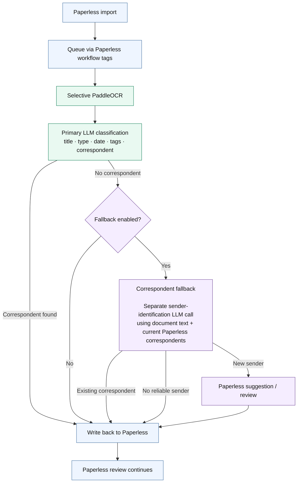

> [!NOTE]
> This project has been entirely vibe-coded. It works in my setup, but it has not been thoroughly reviewed or tested. Expect bugs and use it at your own discretion.

# paperless-local-ai

**Improved OCR and automatic local-LLM metadata assignment for Paperless-ngx — built for modest CPU-only hardware.**

`paperless-local-ai` is for users who want better OCR for scanned documents and a small local LLM to automatically set **titles, document types, dates, tags and correspondents**, without running a full AI suite. It keeps the workload focused by limiting AI to these core tasks and handling the normal metadata classification in a single LLM request — useful on weaker hardware, or simply if that is all you need.

The model output is constrained to the configured Paperless taxonomy and applied directly to the document instead of only being shown as suggestions. If the main classification cannot match an existing correspondent, an optional separate sender-identification stage can either match one of the existing Paperless correspondents or propose a genuinely new one through Paperless' native suggestion/review flow.

## How it fits into Paperless

`paperless-local-ai` sits between normal Paperless import and review. Paperless queues documents through workflow tags, the app processes them locally, and writes the result back to the same document.

Paperless keeps owning the document throughout: `paperless-local-ai` processes the already imported document and writes its results back to the same Paperless record.

Native PDF text is kept, while scanned documents can be selectively reprocessed with PaddleOCR.

The primary classifier handles title, document type, date, tags and an existing correspondent together in **one structured LLM request**.

### Correspondents

The primary classification first tries to match one of the correspondents already present in Paperless.

If it returns no correspondent and the optional fallback is enabled, a **separate sender-identification LLM stage** runs with its own prompt and model settings. It receives the document text together with the current Paperless correspondent list.

- If the sender matches an existing Paperless correspondent, it is applied automatically.
- If the sender is identified but does not exist in Paperless yet, the proposed name is sent to Paperless' native suggestion/review flow.
- If no sender can be identified reliably, the correspondent remains empty.

New correspondents are only added after review in Paperless.

## Why this project?

This project started with running local document AI on modest CPU-only hardware.

Two things became bottlenecks:

- **OCR quality:** Tesseract output from scanned documents was often not clean enough as input for a small local LLM, so PaddleOCR is used where additional OCR is useful.
- **Inference time:** workflows that make a separate LLM request for every metadata field become slow on weak CPUs because the same document context has to be processed repeatedly.

`paperless-local-ai` therefore combines title, document type, date, tags and existing-correspondent classification into **one structured LLM request**. Only an unresolved correspondent can add a second, specialized request.

The scope is deliberately narrow: **OCR and automatic metadata assignment**. Document chat, RAG, semantic search and other AI-heavy features are intentionally left out.

## Control Center

The included Control Center is the web interface for configuring `paperless-local-ai`: Paperless and Ollama connections, pipeline tags, OCR and runtime settings, classification, and the correspondent fallback.

Prompts and model settings can be edited directly in the UI. Before using a change in production, you can preview the exact rendered prompt for an existing Paperless document or run a real Ollama test without modifying the document. The Control Center also shows the allowed Paperless values, structured model output and performance data.

Saved configurations are versioned and can be restored from the UI.

## Reference system

**Intel Core i3-8100 · 16 GB RAM · no GPU · qwen3.5:4b**

Real production examples:

| Task | Time |
|---|---:|
| Normal scanned document — OCR | ~112 s |
| Metadata classification | ~65 s |
| Optional correspondent fallback | ~39 s |

These are example document measurements, not performance guarantees.

## Requirements

Paperless-ngx · Ollama · Docker Compose or TrueNAS SCALE · linux/amd64

Tested with **Paperless-ngx 3.0.5**, **TrueNAS SCALE 25.10.4** and **qwen3.5:4b**. See [Compatibility](docs/compatibility.md) for the exact tested scope.

## Install

Choose **one** deployment guide:

- [Docker Compose](docs/installation.md)
- [TrueNAS SCALE](docs/truenas.md)

After the app is running, complete the shared [Paperless setup](docs/paperless-setup.md), then review and test your settings in [Configuration](docs/configuration.md) before processing normal documents.

More: [Troubleshooting](docs/troubleshooting.md) · [Updating](docs/upgrading.md) · [Compatibility](docs/compatibility.md) · [Architecture](docs/architecture.md)

## Security

The Control Center has no built-in authentication. Keep it on localhost or a trusted network.

## License

MIT. Third-party components retain their own licenses; see [THIRD_PARTY_LICENSES.md](THIRD_PARTY_LICENSES.md).
