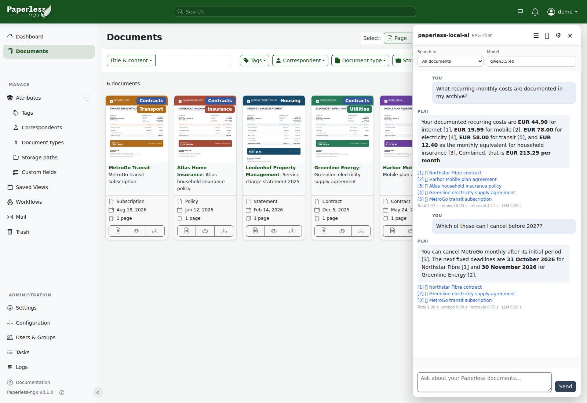
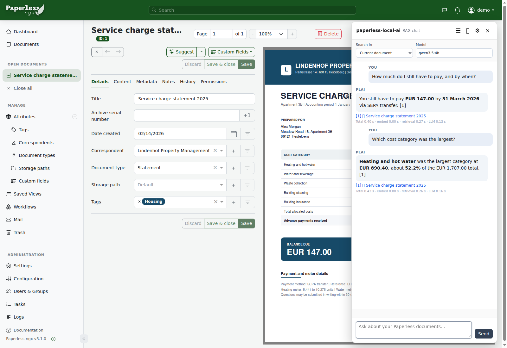
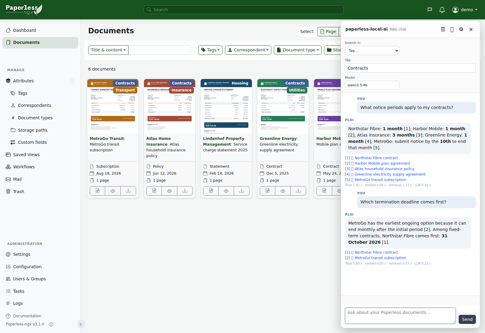

> [!NOTE]
> This project has been entirely vibe-coded. It works well in my setup, but bugs may still exist, so use it at your own discretion. Feedback, bug reports, and pull requests are very welcome.

# paperless-local-ai

**Local OCR, metadata automation and document chat for Paperless-ngx, designed for modest CPU-only hardware.**

Paperless-ngx already includes optional AI features. `paperless-local-ai` is designed for a different operating point: local inference on small self-hosted systems, where repeated model work is expensive and the operator may want direct control over prompts, retrieval and resource use.

It provides three first-class capabilities around an existing Paperless installation:

- **PaddleOCR-based scan OCR** with PP-OCRv6 through Paperless' OCRmyPDF import path;
- **automatic structured metadata** for title, document type, date, correspondent and tags;
- **lightweight multi-turn document chat** with its own local SQLite RAG index and a chat panel inside Paperless.

Paperless remains the document system of record and Ollama remains external. `paperless-local-ai` owns these AI pipelines and their runtime behavior while originals, searchable archives, document text and metadata stay in Paperless.

<p align="center">
  <a href="images/document-chat-all-documents.png">
    
  </a>
</p>

<p align="center">
  <sub>Document chat with synthetic demo documents and responses. Timing values shown in the demo UI are illustrative and are not benchmark results.</sub>
</p>

**[Try the Control Center live demo](https://lucaperl.github.io/paperless-local-ai/demo/)** - an interactive browser-only preview of the administration UI using synthetic Paperless, Ollama and OCR data. Demo values and timings are illustrative only.

## Why a separate local-AI path?

Paperless native AI can already provide AI-assisted metadata suggestions, embedding-backed retrieval and document chat, including with local Ollama. `paperless-local-ai` deliberately uses a smaller and more explicit execution model.

The clearest example is document chat.

In Paperless 3.1.0 through 3.1.3, the native server-side chat path is **single-turn**: it receives the current question and document selection, but no conversation history. It uses a fixed Top-K 5 LlamaIndex retriever, performs a retrieval pass to determine source references, then gives the retriever to a `RetrieverQueryEngine`, which retrieves again for response synthesis. The response synthesizer uses LlamaIndex's compact/refine path.

PLAI instead makes the normal chat turn a fixed project contract:

```text
question + bounded conversation history
→ exactly 1 local embedding request
→ exact cosine retrieval from SQLite
→ local source expansion / metadata / prompt assembly
→ exactly 1 local chat-generation request
→ answer + Paperless source links
```

There is no query-rewrite LLM, reranker LLM, refine chain, summarizer or agent loop on that normal path. Adjacent chunks, live Paperless metadata and retrieval diagnostics are local/API work and add no model request.

PLAI also stores real server-side conversations. Previous user turns can be included explicitly in the retrieval query, while a separately bounded user/assistant history is sent to the answer model. Chats can be reopened, renamed and deleted instead of each question being an isolated request.

Paperless exposes generation/embedding models, backends, context size and embedding chunk size. PLAI additionally owns and exposes the retrieval and prompt layer itself: retrieval-history behavior, Top-K, similarity/document caps, adjacent chunks, document-context budgeting, retrieval diagnostics, query/document embedding templates, prompt assembly and explicit index lifecycle controls.

The same design principle applies outside chat. Metadata runs as an automatic, reviewable workflow with one structured generation request, optional Hybrid-history routing for tags and conservative local correspondent resolution. Heavy OCR, History, embedding and generation work shares one resource slot so it cannot compete for the same CPU and RAM.

`paperless-local-ai` is not a feature-for-feature clone of every native Paperless AI feature. Paperless' native similar-document UI remains separate, and Paperless native AI can suggest storage paths while PLAI metadata automation currently does not manage them.

See [Architecture](docs/architecture.md#native-paperless-ai-and-plai), [RAG chat](docs/rag-chat.md) and [Paperless setup](docs/paperless-setup.md) for the detailed behavior.

## What it provides

### OCR

PP-OCRv6 replaces the recognition stage when Paperless/OCRmyPDF needs OCR. **Medium** is the quality-focused default, with Small and Tiny profiles when lower inference cost matters. The original/archive page is not resized; only the temporary OCR raster is bounded.

### Metadata automation

A Paperless **Document Added** workflow queues a document for local classification. One structured request handles title, document type, date and sender/issuer. Tags join the same request only when the selected tagging route needs an LLM decision.

Two tagging strategies are available:

- **Hybrid tagging**, recommended for compact models, can reuse a complete reviewed tag set only behind explicit similarity/support gates and otherwise falls back to the LLM;
- **LLM direct** always lets the configured model choose from the current Paperless taxonomy.

Correspondents are resolved conservatively against existing Paperless values. Plausible new names can optionally be exposed through Paperless Document Suggestions, but `paperless-local-ai` never auto-creates correspondents.

See [Tagging](docs/tagging.md) and [Configuration](docs/configuration.md#classification).

### Document chat

The Paperless UI integration provides persistent multi-turn chats with scopes for the current document, all documents, tags, correspondents and document types. Answers include deterministic links back to the source documents, with source metadata read live from Paperless.

<table>
<tr>
<td width="50%" valign="top">
  <a href="images/document-chat-current-document.png">
    
  </a>
</td>
<td width="50%" valign="top">
  <a href="images/document-chat-tag-scope.png">
    
  </a>
</td>
</tr>
<tr>
<td valign="top">
  <strong>Current document</strong><br>
  Ask follow-up questions about the document currently being reviewed.
</td>
<td valign="top">
  <strong>Scoped retrieval</strong><br>
  Restrict retrieval to a tag, correspondent or document type.
</td>
</tr>
</table>

<p align="center">
  <sub>Examples use synthetic demo documents and responses. Displayed timing values are illustrative and are not representative of local inference performance.</sub>
</p>

Global administration lives in the Control Center. It exposes chat defaults, prompt assembly, retrieval history, Top-K, similarity/document caps, adjacent chunks, context budgeting, diagnostics, embedding templates/model, chunking, batching/slicing, sync and explicit index lifecycle controls.

The index is a regenerable SQLite cache, not a second document store. The first build is explicit. Incremental sync keeps an active index current; full rebuilds use a staging index and atomic activation so the previous index remains usable until the replacement is ready. Interrupted rebuilds become paused/resumable rather than silently restarting expensive work.

See [RAG chat](docs/rag-chat.md).

## Designed for modest hardware

The project treats a CPU-only home server as a first-class target rather than a fallback configuration.

- OCR, Hybrid-history work, metadata inference, RAG chat and index embedding slices share **one global AI slot**.
- Heavy helpers are loaded on demand and released again.
- Ollama models are explicitly unloaded after work.
- Full-index embedding is divided into bounded slices that release the AI slot between slices.
- RAG uses SQLite and exact cosine retrieval instead of requiring a separate vector database or agent service.
- A GPU can make inference faster, but it is not required by the architecture.

The trade-off is intentional: predictable resource use is prioritized over concurrent AI throughput.

## Reference performance

Measured on an **Intel Core i3-8100 · 4 cores / 4 threads · 16 GB RAM · no GPU · qwen3.5:4b Q4_K_M · PP-OCRv6 Medium / HPI / OpenVINO**.

| Workload | Input | Processing time | Peak RAM |
|---|---|---:|---:|
| OCR · PP-OCRv6 Medium · 3000 px | per page | **~23 s/page** | **~4.3 GiB** |
| Metadata · qwen3.5:4b | ~1–4k prompt tokens | **~40 s–2.5 min** | **~4.2 GiB** |
| Metadata · qwen3.5:4b | ~5–9k prompt tokens | **~3–5.5 min** | **~4.2 GiB** |
| Metadata · qwen3.5:4b | ~9–12k prompt tokens | **~5.5–7.5 min** | **~4.2 GiB** |

Page count is only a rough indicator for metadata. Runtime mainly follows the number of prompt tokens actually processed. A measured ~14k-token fallback took about 8.7 minutes on the same CPU.

These figures are reference measurements. See [Configuration](docs/configuration.md#reference-performance-and-resource-tuning) for RAM points and tuning guidance.

## How it fits into Paperless

**Import and automation path**

```text
Paperless import
→ OCRmyPDF
→ PaddleOCR when OCR is needed
→ searchable Paperless archive/content
→ Document Added workflow
→ local metadata classification/tagging
→ Paperless metadata
→ human review
```

**Interactive document-chat path**

```text
Paperless chat panel
→ current question + bounded prior context
→ one local query embedding
→ exact retrieval from the PLAI SQLite index
→ live Paperless metadata for selected sources
→ one local chat generation
→ answer + Paperless source links
```

<p align="center">
  
</p>

The uploaded PDF remains Paperless' original. PLAI stores its own configuration, configuration history and chat conversations plus regenerable OCR, Hybrid-history and RAG working state.

## Control Center

The Control Center is the administration UI for the complete stack. It covers:

- Paperless and Ollama connections;
- OCR model/language/image limits and recovery behavior;
- metadata workflow, Dry Run and correspondent matching;
- classification model settings and editable prompts;
- Hybrid tagging, reviewed-history health and tag guidance;
- document-chat defaults and prompt assembly;
- retrieval behavior and diagnostics;
- embedding/chunking settings and index Sync/Rebuild/Pause/Resume;
- safe tests and versioned configuration history.

<p align="center">
  <a href="images/control-center-screenshot.png">
    
  </a>
</p>

<p align="center">
  <strong><a href="https://lucaperl.github.io/paperless-local-ai/demo/">Open the interactive Control Center demo →</a></strong>
</p>

The actual document chat lives inside Paperless. Per-chat overrides remain with each server-side conversation.

## Requirements

Paperless-ngx · Ollama · Docker Compose or TrueNAS SCALE · linux/amd64 · GPU not required

Tested reference: **Paperless-ngx 3.1.0 · OCRmyPDF 17.7.1 · TrueNAS SCALE 25.10.6 · Ollama 0.32.11**. See [Compatibility](docs/compatibility.md) for the exact tested scope.

## Install

Choose one deployment guide:

- [Docker Compose](docs/installation.md)
- [TrueNAS SCALE](docs/truenas.md)

Then complete the required [Paperless integration](docs/paperless-setup.md) and review [Configuration](docs/configuration.md).

Further reading: [RAG chat](docs/rag-chat.md) · [Tagging](docs/tagging.md) · [Architecture](docs/architecture.md) · [Troubleshooting](docs/troubleshooting.md) · [Compatibility](docs/compatibility.md)

## Security

The Control Center has no built-in authentication. Keep it on localhost or a trusted network.

The OCR endpoint is authenticated with a separate shared token. Do not expose it directly to the public Internet. The Paperless chat relay is same-origin, uses Paperless session authentication/CSRF protection, and does not expose the Paperless API token or internal relay secret to the browser.

See [SECURITY.md](SECURITY.md).

## License

MIT for this repository's source code. Third-party components retain their own licenses; see [THIRD_PARTY_LICENSES.md](THIRD_PARTY_LICENSES.md).
